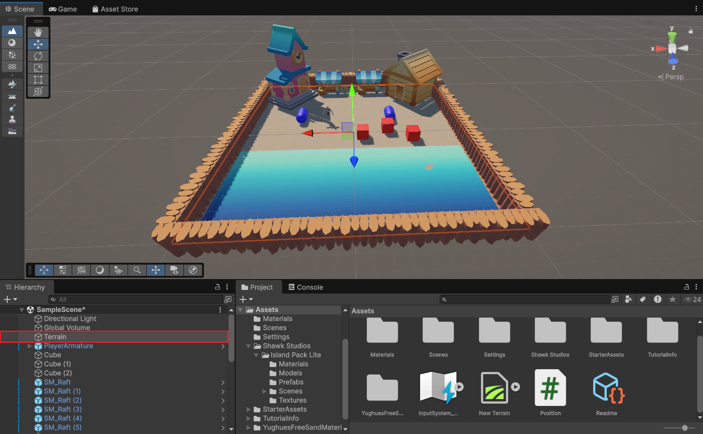

# Practica-1-II
Autor: Eric Bermúdez Hernández
Email: alu0101517476@ull.edu.es

----

# Índice

- [Descripción del trabajo realizado](#descripción-del-trabajo-realizado)
  - [1. Añadir objetos 3D básicos con su etiqueta que los identifique](#1-añadir-objetos-3d-básicos-con-su-etiqueta-que-los-identifique)
  - [2. Incluir en el paquete Starter Assets](#2-incluir-en-el-paquete-starter-assets)
  - [3. Incluir un objeto libre de la Asset Store que no sea de los Starter Assets](#3-incluir-un-objeto-libre-de-la-asset-store-que-no-sea-de-los-starter-assets)
  - [4. Crea un terreno](#4-crea-un-terreno)
  - [5. Cada objeto debe tener una etiqueta que lo identifique](#5-cada-objeto-debe-tener-una-etiqueta-que-lo-identifique)
  - [6. Utilizar prefabs de Starter Asset FPS o Third Person](#6-utilizar-prefabs-de-starter-asset-fps-o-third-person)
  - [7. Agregar un script que escriba en la consola la etiqueta y posición de cada objeto utilizado](#7-agregar-un-script-que-escriba-en-la-consola-la-etiqueta-y-posición-de-cada-objeto-utilizado)


----

Descripción del trabajo realizado
1. Añadir objetos 3D básicos con su etiqueta que los identifique
He añadido los siguientes objetos:
- 3 Cubos
- 2 Capsulas

En la siguiente imagen se demuestra la existencia de los objetos 3D básicos que he comentado. Son los objetos que están seleccionados.


2. Incluir en el el paquete Starter Assets.
En la siguiente imagen se puede ver que en la ventana de "My assets" están los starter assets de Primera y Tercera persona


3. Incluir un objeto libre de la Asset Store que no sea de los Starter Assets.
En el proyecto he incluido varios objetos que no son de los Starter Assets. Estos objetos son:
- Multiples vallas
- 2 edificios
- 2 Mercados
- 2 Taburetes
- 1 Textura de Mar
- 1 Textura de arena

Los siguientes objetos seleccionados son los que no son Starter Assets: 


4. Crea un terreno
He creado un terreno pequeño y mediante el pincel de "paint texture" le he dado al terreno textura de arena. En la imagen se ve como el objeto seleccionado es el propio terreno que he comentado previamente.



5. Cada objeto debe tener una etiqueta que lo identifique.
Todos los objetos tienen asociada una etiqueta. He optado por agrupar a los objetos por una etiqueta según al grupo de objetos que pertenezca. La agrupación que he escogido es la siguiente:
- Los objetos que no son del paquete Starter Assets: Etiqueta "No starter asset"
- Los cubos: Etiqueta "Cube"
- Las cápsulas: Etiqueta "Capsule"
- El terreno: Etiqueta "Terrain"
- El modelo humanoide: Etiqueta "Starter Asset"
- Empty object que está asociado al script: Etiqueta "Logger"

En las siguientes imágenes se demuestra la existencia de las etiquetas asignadas a los objetos:


6. Utilizar prefabs de Starter Asset FPS o Third Person.
En mi caso utilice un prefab del Third Person, que es el siguiente modelo humanoide:


7. Agregar un script que escriba en la consola la etiqueta y posición de cada objeto que hayas utilizado. 
Para hacer esto he creado un script de C# con el siguiente código:
```C#
using UnityEngine;

public class ObjectLogger : MonoBehaviour
{
    void Start()
    {
        // Obtiene todos los objetos activos de la escena
        GameObject[] allObjects = FindObjectsOfType<GameObject>();

        foreach (GameObject obj in allObjects)
        {
            // Solo si está activo en la jerarquía y NO está "Untagged"
            if (obj.activeInHierarchy && obj.tag != "Untagged")
            {
                // Muestra en la consola el nombre, tag y posición
                Debug.Log("Objeto: " + obj.name +
                          " | Tag: " + obj.tag +
                          " | Posición: " + obj.transform.position);
            }
        }
    }
}
```

Después de eso, cree un Empty object y le vinculé el script. A continuación se puede encontrar el GIF animado que demuestra el funcionamiento del Script:


